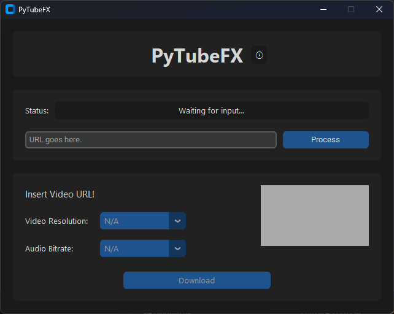

# PyTubeFX (1.0.0)
A simple GUI implementation of [pytubefix](https://github.com/JuanBindez/pytubefix) based on [CustomTkinter](https://github.com/TomSchimansky/CustomTkinter).

<div style='width: 640px; height: 480px; margin: auto'>
	
</div>
<br>

## Dependencies
>These dependencies are only required if you want to launch the app from Python or if you want to build the executable yourself.<br>
>If you just want to use the app, download the prebuilt executable from the [releases section](https://github.com/andrebore04/PyTubeFX/releases).

Make sure you have Python installed. You can download it from [python.org](https://www.python.org/downloads/).

Install the required libraries using the following command:

```sh
pip install -r requirements.txt
```

## Launching the app
Either use the self-contained executable from the releases or follow these steps:

### Clone the repository

```sh
git clone https://github.com/andrebore04/PyTubeFX.git
cd PyTubeFX
```

### Launch [main.py](https://github.com/andrebore04/PyTubeFX/blob/main/main.py):

```
python ./main.py
```

## Building the executable
>I avoided using [Pyinstaller](https://pypi.org/project/pyinstaller/), since the executable created was being flagged by 20+ antiviruses as malware of some sort.<br>
It should only be a bug and will probably be resolved in one of the future releases.<br>
>For the time being, I will be using [Nuitka](https://pypi.org/project/Nuitka/) to build the executable.

To build yourself a self-contained executable that doesn't require Python installed and can be redistributed, follow these steps:

### Install Nuitka

```pip
pip install Nuitka
```

>**Important note**: Nuitka compiles Python to C, so you need to have a compatible C (or C++) compiler installed, refer to [Nuitka's requirements section](https://nuitka.net/doc/user-manual.html#requirements) for more information.

### Clone the repository

```sh
git clone https://github.com/andrebore04/PyTubeFX.git
cd PyTubeFX
```

### Finally, build the app

```sh
nuitka --follow-imports --onefile --disable-console ./main.py
```

## Improvements
These are some known bugs to fix and general features that could be added in the next releases:
- Fix graphics and fonts being a bit tight on linux (as seen on Ubuntu 22.04.3).
- Implement langauge files and convert app to use them.
- Find a workaround to setup oauth without having to use [pytubefix's CLI](https://github.com/JuanBindez/pytubefix/blob/main/pytubefix/innertube.py#L335); this would make it possible for users to download private and age-restricted videos.
- Implement "Advanced Mode", with different codec options and support for higher resolutions.

## Contributing
Any contribution is gladly accepted, I will forever be greatful to you.